# --Springcloud
使用Spring Boot和MyBatis设计和实现后端服务，结合微服务架构实现系统的高效、灵活扩展。通过搭建后端系统，确保学生信息管理、迎新管理、宿舍管理等功能的稳定性和高效性。同时，我还与前端团队合作，利用Axios、Vue和ECharts等技术实现数据可视化和页面展示。

| 分类         | 技术/内容        | 说明 |
|--------------|------------------|------|
| 后端框架     | Spring Boot       | 快速搭建高效、稳定的后端服务 |
| 持久层框架   | MyBatis           | 简化数据库操作与持久层开发 |
| 架构模式     | 微服务架构        | 支持系统高效、灵活扩展 |
| 核心功能模块 | 学生信息管理、迎新管理、宿舍管理 | 保证功能的稳定性与高效性 |
| 前端框架     | Vue.js            | 构建响应式、高效的用户界面 |
| 数据交互     | Axios             | 实现前后端数据通信 |
| 数据可视化   | ECharts           | 提供直观、丰富的数据展示 |

# 3.1 需求描述

## 3.1.1 学生

1. **个人信息管理**：可查询个人基本信息，如学籍成绩、住宿信息、个人违纪处分情况等。
2. **业务办理**：在线提交学生证办理、进行校园卡充值；提交宿舍报修申请等。
3. **学习服务**：查询选课、成绩、资助等信息。
4. **生活服务**：查询宿舍卫生检查记录、违纪记录等；参与迎新活动中的预报登记等环节，以及离校时的相关手续办理。

## 3.1.2 教师

1. **学生信息管理**：查询所教学生的学籍成绩、学期测评结果等信息；管理资助、奖惩信息。
2. **教学管理**：录入学生成绩。
3. **生活服务管理**：查询所管理宿舍的基本信息；处理宿舍报修和离校申请。

## 3.1.3 院系负责人

1. **学生信息管理**：导入、导出学生信息；审核学生信息变更申请，如学籍调动申请；统计分析学生信息数据。
2. **教学管理**：查询、添加、修改课程信息；管理学生成绩、奖惩、资助等。
3. **生活服务管理**：查询、添加、修改校园卡、学生证信息；管理宿舍的信息，如违纪记录、报修申请等。
4. **审核管理**：审核教师和学生提交的各种申请，如学生证办理申请、学籍调动申请。

# 3.2 功能需求

## 3.2.1 学生信息管理

### 1. **档案维护**：

- 院系负责人应能够新增、修改、删除学生档案信息，包括基本信息（姓名、性别、出生日期、民族等）、联系方式等。
- 对于修改和删除操作，需要记录操作日志，以便追溯历史变更情况。

### 2. **信息查询**：

- 所有用户角色（根据各自权限）应能查询学生档案信息。例如，教师查询所教学生的基本信息；学生可查询本人的全部档案信息。
- 支持多条件查询，如按学生姓名、以及各模块的特有的条件进行组合查询，以便快速定位所需学生信息。

### 3. **学籍调动申请**：

- 学生提交学籍申请要求，填写调动原因、目标院系等相关信息。
- 院系负责人应能查看、审核学生学籍调动申请，并记录审核意见和结果。

### 4. **个人违纪处分**：

- 院系负责人和教师可在系统中记录学生的个人违纪处分情况，包括违纪事件、处分类型等信息。

## 3.2.2 迎新管理

### 1. **预报登记**：

- 新生应能通过系统提前进行预报登记，填写个人基本信息、报到时间、备注等。
- 系统应能根据新生的预报登记信息分类进行统计和安排。

### 2. **报道行政流程**：

- 新生报到时，系统应能引导其完成各项行政流程，如报道登记、新生签到、学生证办理等。
- 院系负责人应能通过系统查看新生的报道进度，以便及时协调处理问题。

## 3.2.3 学生工作

### 1. **学生证办理**：

- 学生可以通过系统提交学生证办理申请，填写备注，系统根据学生个人信息自动生成校园卡。
- 院系负责人应能查看、审核该申请。

### 2. **学生选课**：

- 学生可以通过课程名称和课程编号搜索课程加入选课。
- 学生可以查看该课程的详细信息，如课程学分、授课老师等。

### 3. **校园卡充值**：

- 学生应能通过系统进行校园卡充值操作，可选择充值金额并进行充值。
- 系统应能实时更新余额信息，并提供余额查询功能。

### 4. **学籍成绩**：

- 教师应能通过系统录入所教学生的学籍成绩。
- 学生应能查询本人的学籍成绩，如每个课程的成绩。

### 5. **奖惩管理**：

- 教师可以通过系统提交学生的奖惩建议、建议奖惩类型等信息。
- 院系负责人应能查看、审核该申请、并记录审核意见和结果。
- 系统应能记录学生的所有奖惩情况，学生应能查询本人的奖惩记录。

### 6. **资助发放**：

- 院系负责人应能通过系统管理资助发放工作。包括确定资助对象、金额、资助类型等。
- 学生应能查询本人是否获得资助以及获得资助的金额等信息。

### 7. **健康记录**：

- 学生应能添加个人的身体信息，如身高、体重、过敏史等。
- 院系负责人可以添加、修改、删除学生健康记录。

## 3.2.4 宿舍管理

### 1. **住宿信息查询**：

- 所有用户角色应能查询学生的住宿信息，如宿舍号。
- 支持多条件查询，如按宿舍名称、负责老师等进行组合查询，以便快速定位所需学生住宿信息。

### 2. **宿舍卫生检查**：

- 相关工作人员（院系负责人、教师等）应能通过系统记录宿舍卫生检查结果，包括检查时间、卫生状况、存在问题等信息。
- 学生应能查询本人所在宿舍的卫生检查结果。

### 3. **违纪管理**：

- 相关工作人员（院系负责人、教师等）应能通过系统记录学生宿舍内的违纪情况，包括违纪类型、违纪详情、处罚措施等。
- 学生应能查询本人在宿舍内的违纪情况。

### 4. **报修**：

- 学生应能通过系统提交宿舍设备报修申请，选择宿舍并选择报修类型、描述故障等信息。
- 相关工作人员（院系负责人、教师等）应能查看、审核该申请。
- 学生应能查询报修申请和审核情况和报修进度。

### 5. **假期留校管理**：

- 学生应能通过系统提交留校申请，填写留校时间、留校原因等信息。
- 相关工作人员（院系负责人、教师等）应能查看、审核该申请，并记录审核意见和结果。

## 3.2.5 毕业管理

- 准毕业生应能通过系统查询毕业离校流程，并且查看毕业进度。
- 相关工作人员（院系负责人、教师等）应能对准毕业生进行管理，并且查看准毕业生的毕业流程进度。

## 3.2.6 数据可视化

### 1. **数据集成**：

- 系统应能收集、整合来自各个功能模块的相关数据，如学生信息管理模块的学生档案数据、学籍成绩数据；迎新管理模块的预报登记数据、报道行政流程数据等。

### 2. **数据分析**：

- 对集成的数据进行分析，如分析考试成绩（如平均分、成绩分布等）；宿舍类违纪情况统计等。

### 3. **数据呈现**：

- 以直观的方式呈现分析结果，如通过图表（柱状图、折线图、饼图等），方便不同用户角色查看和使用。

  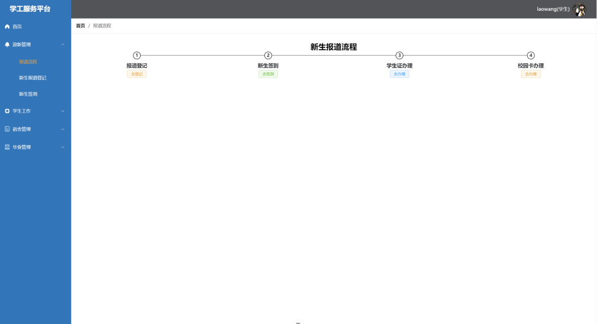 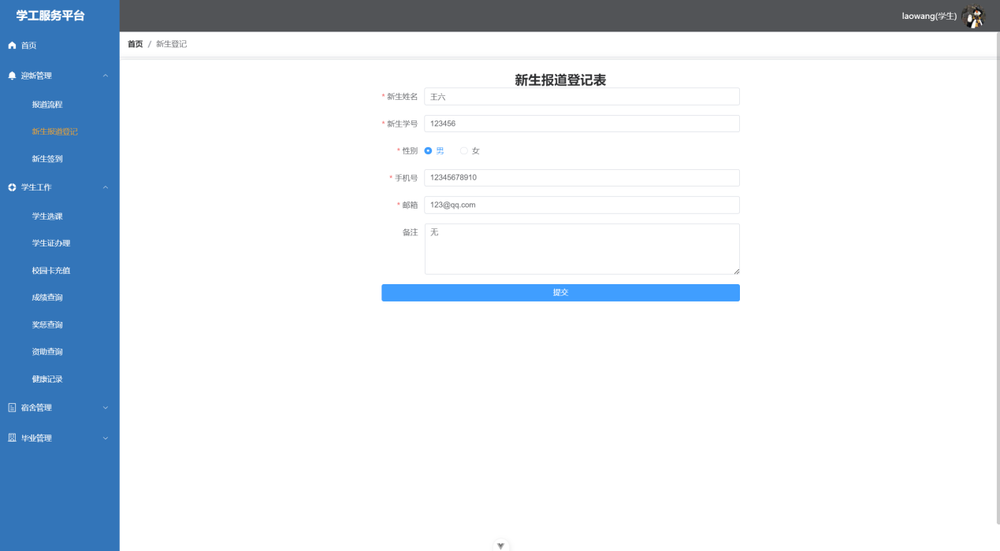 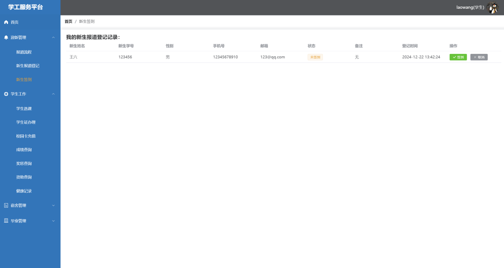 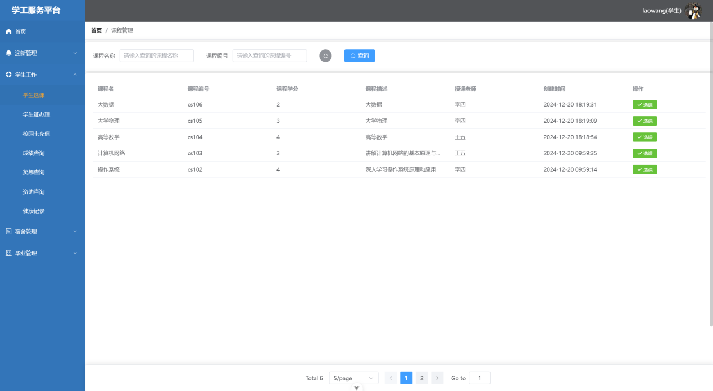 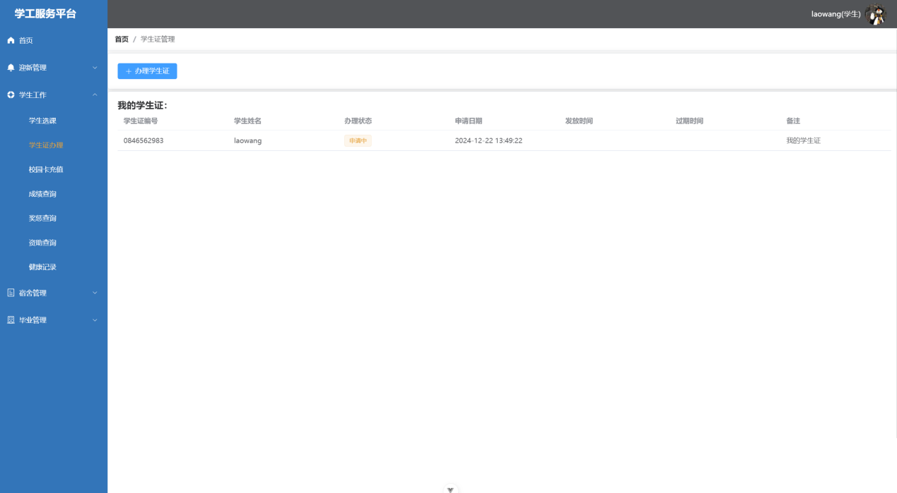 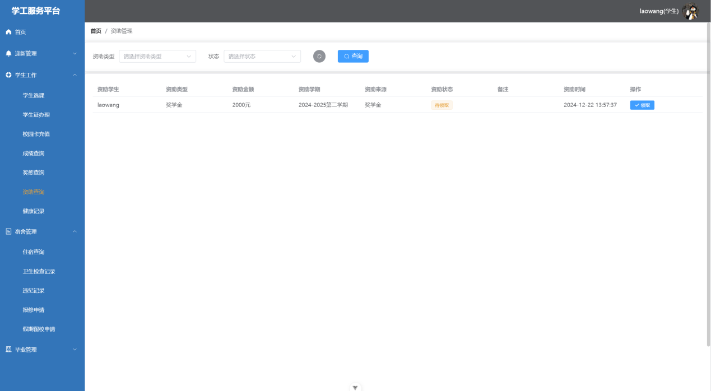 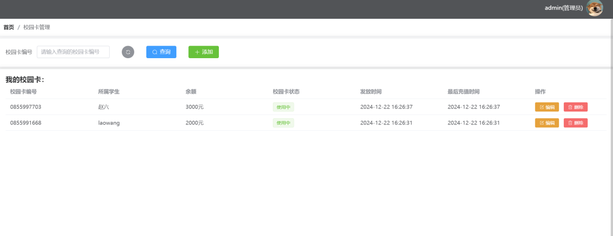 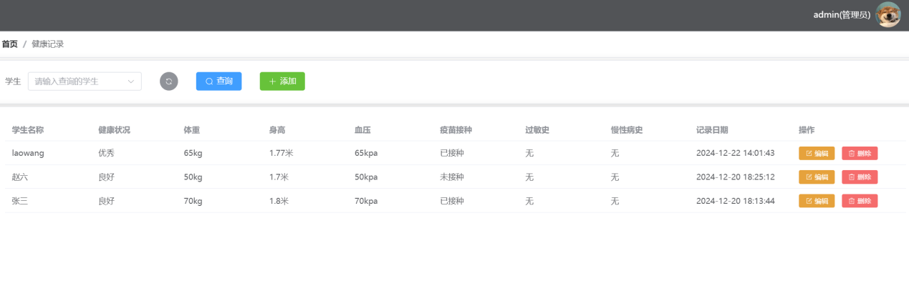 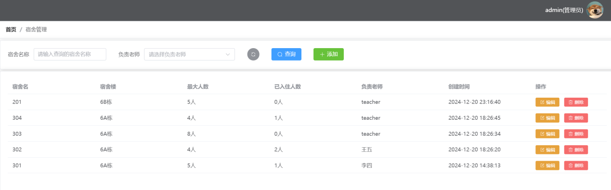 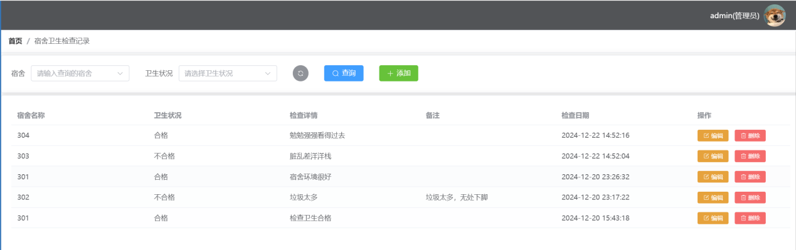 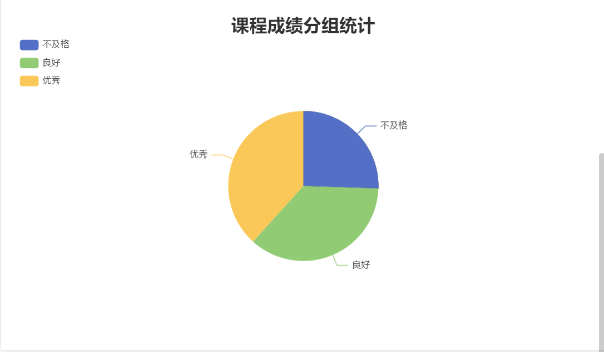 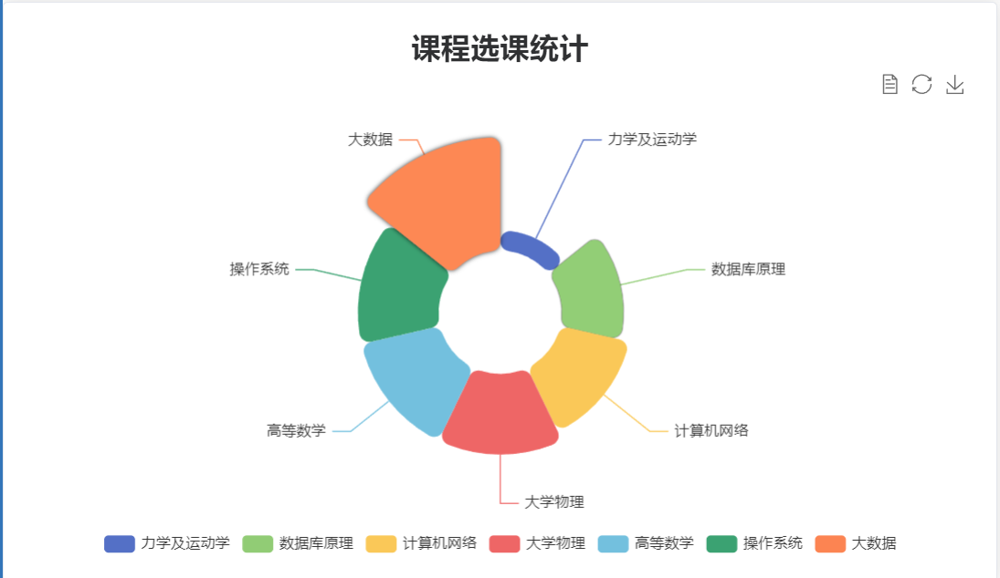 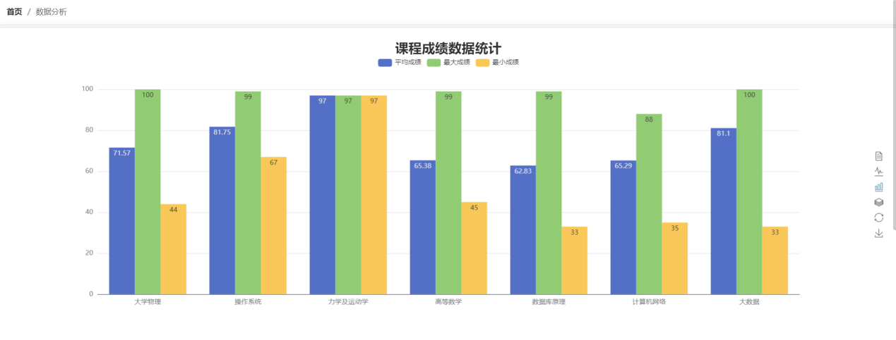 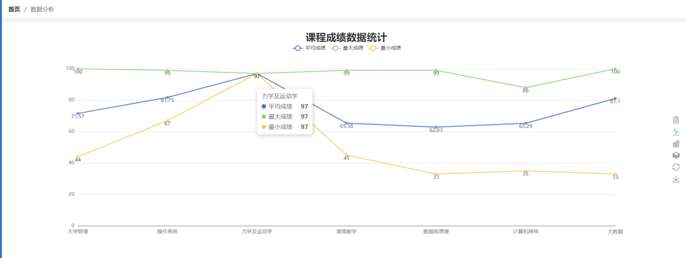

